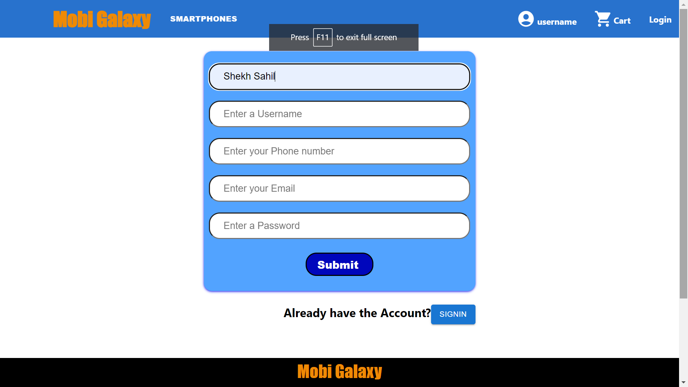
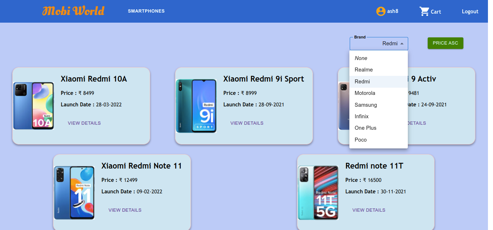
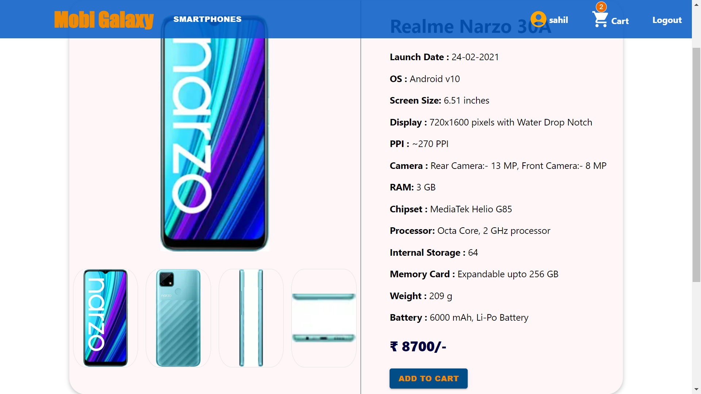
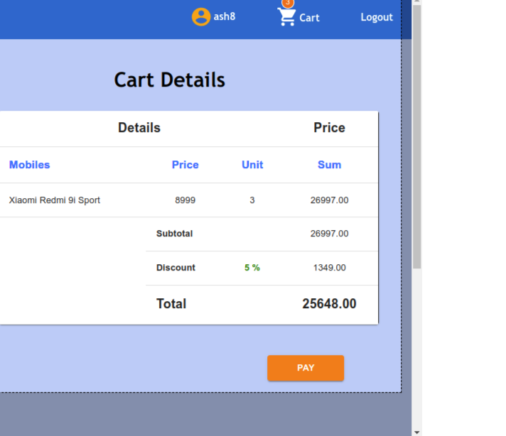
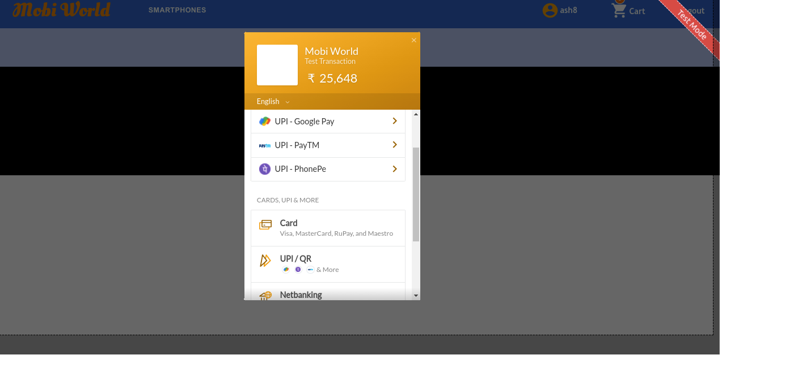

# Mobi-Galaxy
<table>
<tr>
<td>
 A Simple responsive E-Commerce Web Application of SmartPhones under ₹10000 and ₹20000
  And adding some important feature in application. You can Check it out.
</td>
</tr>
</table>


## Built with Tech Stacks:
- React.js
- Redux.js
- MaterialUI
- CSS
- Nodejs
- Expressjs
- MongoDB-Atlas
- Razorpay


## Features

* ### Use of <kbd> React Hook Form </kbd> for both Signup and Sign in.



<br>

* ### Filter Mobiles on Brand name


<br>

* ### Product Specification with Important Key Features.


<br> 

* ### Unit increase and Decrease, Remove item and Cart count on Navbar Cart Icon.


<br>

* ### Cart Items Details in Table format with discount.


<br>

* ### Razorpay Payment Template - All Payment methods.


<br>


## [Getting Started]

### Execution..

Want to run in your local Machine? Great!

To run, follow these steps:

-  Clone the repository
    
-  https://github.com/sahilshekh/weblight-assignment
  
- Open the code in your VS code.
- Initialize the server npm run server in the terminal.
- Then you can start using application.
<br>

#### Deployment Link

<br>

Deployed in Netlify and To know more Copy this Link.
```
https://weblight-assignment.netlify.app/
```

<hr>
<br>
## Creator

- [@Sahil Shekh]()
