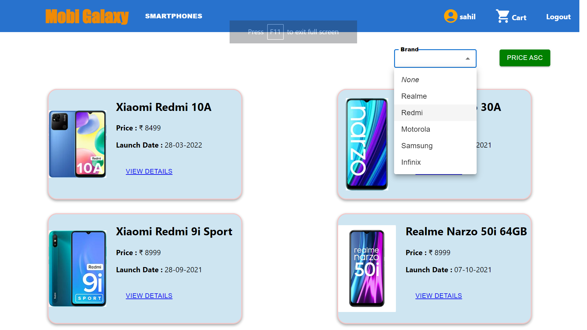
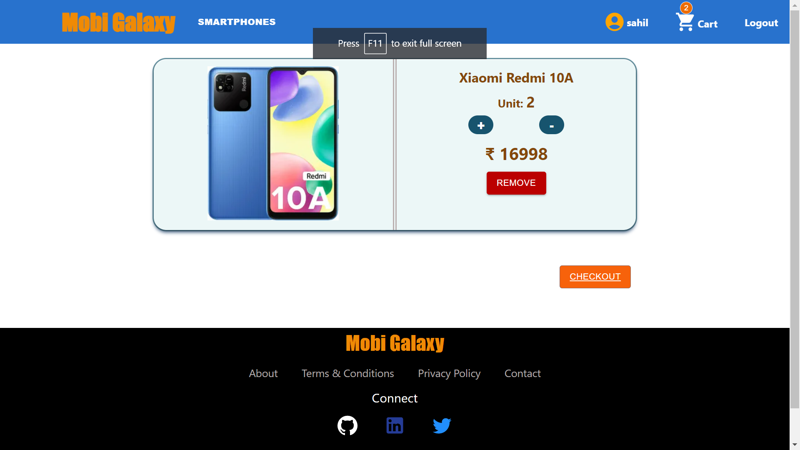

# Mobi-Galaxy

## A Simple responsive E-Commerce Web Application of SmartPhones under ₹10000 and ₹20000, built with React and Material UI

<br>

## Features

* ### Use of <kbd> React Hook Form </kbd> for both Signup and Sign in.


<br>

* ### Filter Mobiles on Brand name


<br>

* ### Product Specification with Important Key Features.


<br> 

* ### Unit increase and Decrease, Remove item and Cart count on Navbar Cart Icon.


<br>

* ### Cart Items Details in Table format with discount.


<br>

* ### Razorpay Payment Template - All Payment methods.


<br>

#### Deployment Link

<br>

Deployed in Netlify and To know more Copy this Link.
```
https://weblight-assignment.netlify.app/
```

<hr>
